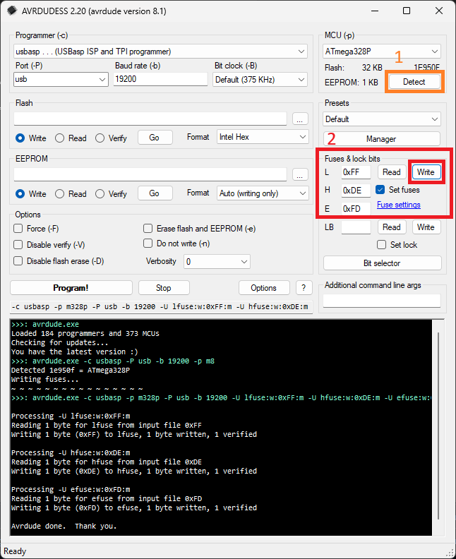

# Arduino

## Step 1 - Set Fuses

### Method 1 - Manual - Windows GUI

* Download AVRDUDESS GUI and run it - https://github.com/ZakKemble/AVRDUDESS
* Select your programmer from the list, change the port to match your hardware and click on **Detect under MCU(-p)**.
* Enter the following fuse values under **Fuses & lock bits:** L=0xFF H=0xDE E=0xFD
* Select Set Fuses and click on Write

The raw commands for official and clone USBasp's are:
original - avrdude.exe -c usbasp -p m328p -P usb -b 19200 -U lfuse:w:0xFF:m -U hfuse:w:0xDE:m -U efuse:w:0xFD:m
clone - avrdude.exe -c usbasp-clone -p m328p -P usb -b 19200 -U lfuse:w:0xFF:m -U hfuse:w:0xDE:m -U efuse:w:0xFD:m

### Method 2 - Script - Windows Command Line

This method uses an original USBasp hardware programmer and the AVRDUDE programming software.

* Download setfuses_avrdude.zip
* Extract setfuses_avrdude.zip to C:\Temp or any other location
* Connect your USBasp programmer to your PC and install the libusbK driver through Zadig - https://zadig.akeo.ie/
* Disconnect the USBasp
* Connect the USBasp to the Novus T1200XE board with 6 jumper wires
* Reconnect the USBasp and run setfuses.cmd

## Step 2 - Burn Bootloader

* Disconnect the USBasp
* Reconnect the USBasp and open Arduino IDE
* Select "USBasp" under Tools | Programmer
* Open the Tools menu again and select "Burn Bootloader"
* Disconnect the USBasp

## Step 3 - Upload Code

* Insert a USB Type-C cable into the Novus T1200XE
* Open the .ino file in Arduino.
* Select "Arduino Pro or Pro Mini" under "Arduino AVR Boards"
* Select your COM port
* Upload

Done!

## Possible Issues

If you encounter issues during the programming of the fuses (cannot set sck period, etc.), please update the firmware on your USBasp to usbasp.2011-05-28.tar.gz from the official website - https://www.fischl.de/usbasp/

You can view this video on the update process - https://www.youtube.com/watch?v=MT_v0yea0Ik

It's recommended to disconnect and reconnect the USBasp between commands to avoid programming issues in Windows.